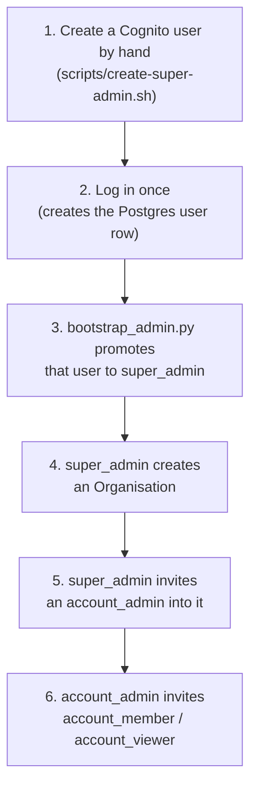

# How login, users and roles work (plain-language walkthrough)

There is no public "Sign up" button anywhere in this app. Every account is
created by someone who already has authority — starting with one manual
bootstrap step for the very first person. This doc walks through that chain
end to end, with a real example.

## The chain, in order

Nobody below step 3 can create the thing above them. A `super_admin` is the
only role that can create an Organisation; an `account_admin` is the only org
role that can invite more people into it.

## Step by step, with the example we actually ran

### 1–3. Bootstrapping the first login

There's no API route that grants the very first super_admin — if there were,
anyone could call it. So it's a one-time manual process:

1. `scripts/create-super-admin.sh niralempiric@gmail.com` creates a Cognito
   user directly (bypassing the invite flow, since there's nobody yet to send
   an invite), logs them in once against the running backend (which is what
   creates their row in Postgres), and runs `backend/scripts/bootstrap_admin.py`
   to flip `is_platform_admin = true` on that row.
2. That script **refuses to run again** once any super_admin exists — it's a
   one-shot, not something you can call twice by accident.

Result: `niralempiric@gmail.com` is now a platform `super_admin`.

### 4. Creating an Organisation

Only a `super_admin` can do this (`/admin/orgs` → "New organisation").
Whoever creates it is automatically made that org's `owner` — so the
super_admin who created "Empiric" is also a member of it, not just its
creator from the outside.

### 5–6. Inviting people in

Inside an org's **Users** tab, clicking "Invite user" needs an email, a name,
and a role. This is the same action whether a super_admin is inviting the
org's first admin, or an `account_admin` is inviting a regular member —
the difference is only *who is allowed to click the button*.

What happens when you invite someone:

1. Backend pre-creates their Cognito account (no password yet) and emails
   them a link: `http://localhost:5173/invite/<token>`.
2. They open it, choose a password.
3. One request (`POST /api/um/invites/complete`) sets the password, signs
   them in, creates their Postgres user row, and adds their membership —
   all at once. They land in the app already logged in.

## The roles, in plain terms

| Role | Where it applies | Can do |
|---|---|---|
| `super_admin` | Whole platform | Create/manage Organisations. Manage any user. The only role that exists outside of an org. |
| `account_admin` | One Organisation | Everything a member can, **plus**: invite/remove people, change their roles, rename or delete the org. |
| `account_member` | One Organisation | Create, edit and delete projects (and everything inside them: personas, diagrams, wireframes, documents). Cannot manage members. |
| `account_viewer` | One Organisation | Read-only — can open and look at every project in the org, cannot change anything. |

A person's role is **per-organisation** except `super_admin`, which is
platform-wide. Someone can be `account_admin` in one org and
`account_viewer` in a different one — membership and role are attached to
the (user, org) pair, not to the user alone.

## Why it's built this way (the "why", not just the "what")

- **No self-signup** → nobody can grant themselves access; every account
  traces back to a person who already had authority to invite them.
- **One-shot bootstrap script instead of an API route** → there is no
  "become admin" endpoint to ever have to secure, because it doesn't exist
  once the first super_admin is made.
- **Creator becomes owner automatically** → an org can never end up with zero
  admins right after creation.
